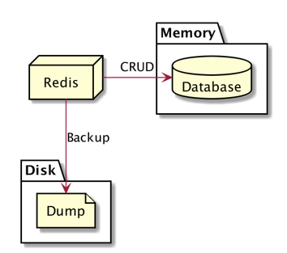
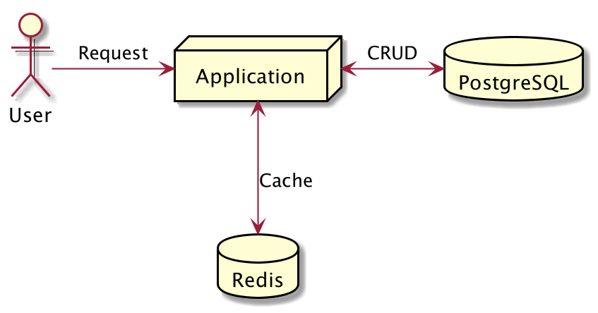
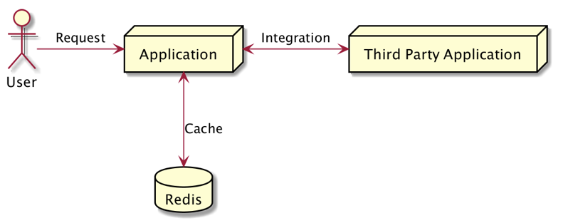
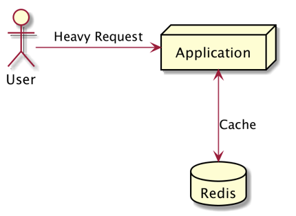
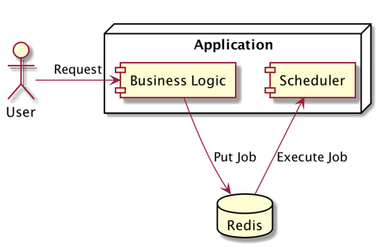
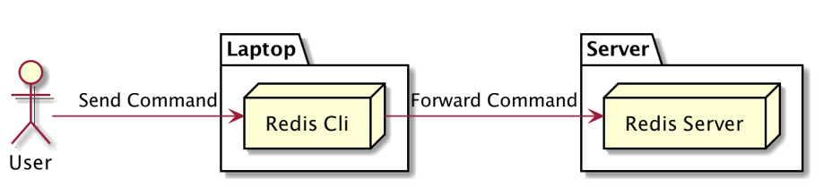

# Dari Programmer Zaman Now

# 1 - Pengenalan Redis

Redis singkatan dari Remote Dictionary Server adalah sistem basis data key-value berbasis memory

> Dictionary = tipe data seperti map, key value
> data yang dimasukkan ke redis akan dimasukkan ke dalam ram bukan harddisk
> redis jarang digunakan sbg datbase utama, karena kalau komputer mati data nya hilang.

Pertama kali rilis tahun 2009 sebagai project open source  
https://redis.io/

## Apa Itu Key-Value Database?

Redis adalah sistem basis data berbasis key-value  
Paradigma key-value adalah **paradigma dimana data disimpan dalam bentuk pair (key-value)**
Key mirip dengan **primary key dari data**, sedangkan value adalah **isi dari datanya**

## Key-Value Database

  
value dapat diisi csv,json, dll, kalau key harus string.

## Apa Itu In-Memory Database?

Redis menyimpan datanya di memory, namun kita bisa memintanya untuk menyimpan datanya secara regular permanen di disk.  
Data di disk hanya dijadikan backup ketika redis berjalan ulang, selama redis berjalan, redis hanya akan melakukan manipulasi data ke memory

> artinya maksimal data yang disimpan sesuai dengan jumlah memory nya.
> data yang ada di harddisk hanya sebagai backup oleh redis, bukan menyimpan data.

  
setiap kali melakukan CRUD akan dilakukan di memory (RAM). Secara reguler akan melakukan backup (dump) ke disk.
Tujuannya ketika redis mati, akan membaca hasil backup nya di disk.  
Kapasitas yang dapat dibackup sesuai dengan jumlah memory.

## 2 - Kapan Butuh Redis?

Saat kita membuat aplikasi, tidak langsung wajib menggunakan Redis  
Redis menggunakan memory sebagai media penyimpanan utama, otomatis harga memory lebih mahal dibandingkan disk  
Untuk menggunakan Redis, kita perlu lihat kasusnya secara detail

1. Ketika Database Utama Lambat  
     
   Contohnya kita punya database postgre, ada 1 query yang berat. Kalau datanya besar nanti, butuh waktu yang lama sekali. Walau sudah di tunning, optimize. Redis digunakan sebagai cache.

   Request pertama akan mengambil data ke database (postgre) lalu hasilnya disimpan ke redis (bisa dalam bentuk json), baru dibalikan ke usernya. Ketika ada user ke2 melakukan request yang sama, maka data akan diambil dari redis. Redis menggunakan memory jadi latensi nya bisa nano second.

2. Ketika Aplikasi Lain Lambat  
     
   Contoh nya ecommerce, butuh konek ke 3rd seperti payment gateway, logistik dll. Ketika aplikasi 3rd party memberikan respon yang lambat, maka kita bisa cache datanya ke dalam redis. Kita tidak bisa mengubah aplikasi 3rd party.

   Request ke2 akan mengambil dari redis.

3. Ketika Ada Proses Berat di Aplikasi  
     
   Misal 1 proses membutuhkan kalkulasi yang berat dan selalu itu saja hasilnya, maka hasil kalkulasi disimpan di redis.

4. Membuat Delayed Job  
     
   seperti php dan perl tidak bisa spawn thread baru/ tidak bisa melakukan asynchronus maka cocok pakai redis.  
   Comtohnya kirim email (lambat), dikirim ke redis (langsung dibalikan ke user sukses), lalu scheduler akan mengambil email dari redis.

   kalau di laravel ada laravel job untuk redis, kalau ruby ada juga delay job menggunakan framework rails

5. Dan masih banyak lainnya  
   Rata-rata redis digunakan untuk mempercepat `aplikasi yang lambat `
   Dan juga redis biasa digunakan untuk `caching`, menyimpan data secara sementara

## 3 - Menginstall Redis

https://redis.io/download  
Redis adalah aplikasi yang dibuat menggunakan bahasa pemrograman C  
Untuk menggunakan redis, kita harus melakukan kompilasi kode program Redis nya  
Disarankan menggunakan Docker untuk menjalankan redis, karena sampai saat ini belum tersedia binary file redis untuk Windows, Mac atau Linux

> dulu support binary windows hanya sampai redis 2.

### Menginstall Redis via Docker

Docker Image : https://hub.docker.com/_/redis/  
Docker Compose : https://github.com/ProgrammerZamanNow/belajar-redis/blob/master/redis/docker-compose.yaml  
Belajar Docker : https://www.youtube.com/playlist?list=PL-CtdCApEFH-A7jBmdertzbeACuQWvQao

```bash
docker-compose -f 1-redis-basic-compose.yaml up -d
```

untuk down nya

```bash
docker-compose -f 1-redis-basic-compose.yaml down
```

### Redis Server vs Redis Cli



Saat kita menginstall Redis, ada 2 aplikasi yang terinstall, Redis Server dan Redis Cli  
Redis Server adalah aplikasi server untuk Redis itu sendiri  
Redis Cli adalah aplikasi command line untuk client, dimana digunakan untuk berkomunikasi dengan Redis Server

#### Konek ke Redis Server via Redis Cli

`redis-cli -h <host> -p <port>`

> kalau tidak ada port otomatis menggunakan port defaultnya

masuk ke docker container untuk buka redis nya

```bash
docker container exec -it redis_basic bash
```

lalu masuk ke redisnya

```bash
redis-cli -h localhost
```

> kalau di prod, host nya diganti bukan localhost, seperti ip/domain

untuk mengecek terkoneksi dengan server, ketik `ping` di cli

## 4 - Configuration

Saat menjalankan redis, redis tidak butuh file konfigurasi  
Namun jika tidak menggunakan file konfigurasi, redis akan berjalan menggunakan konfigurasi default  
Ada baiknya kita membuat file konfigurasi agar pengaturannya bisa diubah, seperti maksimal memori yang bisa digunakan.  
https://github.com/antirez/redis/blob/6.0/redis.conf

Docker Compose : https://github.com/ProgrammerZamanNow/belajar-redis/blob/master/redis-with-config/docker-compose.yaml

> disesuaikan dengan versi nya

docker-compose up

```bash
docker-compose -f 2-redis-basic-compose-with-config.yaml up -d
```

docker-compose down

```bash
docker-compose -f 2-redis-basic-compose-with-config.yaml down
```

## 5 - Database

Redis memiliki konsep database seperti pada relational database mysql atau postgre  
Di redis kita bisa membuat database dan menggunakan database nya  
Namun sedikit berbeda, jika di relational database kita bisa membuat database dengan menggunakan nama database, di redis kita hanya bisa menggunakan angka sebagai database  
Secara default database di redis adalah 0 (nol)  
Kita bisa menggunakan database sejumlah maksimal sesuai dengan konfigurasi yang kita gunakan di file konfigurasi

default nya di redis.conf, maksimal database yang ada 16 (mulai dari 0 sampai 15).
rata-rata 1 aplikasi 1 redis aja.

### Operasi Database

| Operasi         | Keterangan                |
| --------------- | ------------------------- |
| select database | Selecting database number |

## 6 - Strings

Redis sebenarnya mendukung struktur data yang banyak, seperti String, List, Set, dan lain-lain  
Namun yang paling sering digunakan adalah struktur data String

### Operasi Data String

| Operasi           | Keterangan                               |
| ----------------- | ---------------------------------------- |
| set key value     | Set the string value of a key            |
| get key           | Get the value of a key                   |
| exists key        | Determine if a key exists                |
| del key [key ...] | Delete a key                             |
| append key value  | Append a value to a key                  |
| keys pattern      | Find all keys matching the given pattern |

> di redis kalau menyimpan dengan key yang sama, maka dianggap update
> key hanya bisa ambil satu saja, kayk banyak data gunakan keys pattern

### Operasi Range Data String

| Operasi                   | Keterangan                                                         |
| ------------------------- | ------------------------------------------------------------------ |
| setrange key offset value | Overwrite part of a string at key starting at the specified offset |
| getrange key start end    | Get a substring of the string stored at a key                      |

### Operasi Multiple Data String

| Operasi                        | Keterangan                           |
| ------------------------------ | ------------------------------------ |
| mget key [key ...]             | Get the values of all the given keys |
| mset key value [key value ...] | Set multiple keys to multiple values |

## 7 - Expiration

Secara default saat kita menyimpan data ke redis, redis akan menyimpannya secara permanent sampai kita menghapusnya  
Kadang kita mendapatkan kasus ingin menghapus data di redis secara otomatis dalam waktu tertentu  
Misal kita menyimpan data cache di redis selama 10 menit, setelah 10 menit kita akan query ulang ke database untuk mendapatkan data terbaru  
Hal ini bisa dilakukan di redis, redis memiliki fitur expiration secara otomatis pada data yang kita simpan di redis

Operasi Expiration Data String
| Operasi | Keterangan |
| ------------------------------ | ------------------------------------ |
| expire key seconds | Set a key's time to live in seconds |
| setex key seconds value | Set the value and expiration of a key |
| ttl key | Get the time to live for a key |

> ttl = time to live

## 8 - Increment & Decrement

Operasi Increment & Decrement sekilas sangat mudah dilakukan, hanya tinggal mengupdate data yang di redis dengan data baru (data lama ditambah 1)  
Namun jika operasi dilakukan secara paralel dan dalam waktu yang sangat cepat, hal ini bisa memungkinkan `race condition`  
Untungnya redis memiliki operasi untuk melakukan increment dan decrement

> sebenarnya di redis tidak ada type number  
> kalau mau menggunakan Increment & Decrement, maka pastikan value nya berupa number

Manual Increment & Decrement `(Tidak Aman)`

> value = GET key  
> value = value + 1  
> SET key value

### Operasi Increment & Decrement

| Operasi              | Keterangan                                               |
| -------------------- | -------------------------------------------------------- |
| incr key             | Increment the integer value of a key by one              |
| decr key             | Decrement the integer value of a key by one              |
| incrby key increment | Increment the integer value of a key by the given amount |
| decrby key decrement | Decrement the integer value of a key by the given number |

> incrby & decrby, increment dan decrement bisa kita tentukan
> program ini cocok kalau mau buat operasi kenaikan dan penurunan, agar tidak terjadi race condition

## 9 - Flush

Kadang kita butuh mengosongkan seluruh data di redis, misal ketika terjadi kesalahan kode sehingga menyebabkan data di redis salah  
Menghapus data di redis satu-satu menggunakan operasi delete bukanlah hal yang bijak  
Redis memiliki fitur untuk menghapus seluruh data di database redis, yaitu operasi flush

### Operasi Flush

| Operasi  | Keterangan                                |
| -------- | ----------------------------------------- |
| flushdb  | Remove all keys from the current database |
| flushall | Remove all keys from all databases        |

## 10 - Pipeline

Perintah yang dikirim dari client ke server redis menggunakan Request/Response protocol  
Artinya tiap request yang dikirim ke server redis, maka redis akan membalasnya secara langsung  
Kadang ada kebutuhan kita mengirim data ke redis dalam jumlah besar, misal ketika ada kasus memindahkan data dari database mysql ke redis  
Jika kita mengirim satu per satu datanya, maka akan butuh waktu lama untuk selesai  
Redis mendukung operasi bulk via pipeline, dimana kita bisa mengirim beberapa perintah sekaligus dalam satu request  
Namun perlu diketahui, `server redis tidak akan membalas tiap perintah yang dikirim via pipeline`

Operasi Pipeline Menggunakan Redis Cli

```cli
redis-cli --pipe
```

## 11- Transaction

Seperti pada database relational, redis juga mendukung transaction  
`Proses transaction adalah` proses dimana kita mengirimkan beberapa perintah, dan perintah tersebut akan dianggap sukses jika semua perintah sukses, jika gagal maka semua perintah harus dibatalkan

| Operasi | Keterangan                              |
| ------- | --------------------------------------- |
| multi   | Mark the start of a transaction block   |
| exec    | Execute all commands issued after MULTI |
| discard | Discard all commands issued after MULTI |

> multi ~ transaction  
> exec ~ commit  
> discrad ~ rollback

## 12 - Monitor

Kadang ada kasus kita ingin mendebug aplikasi saat berkomunikasi dengan redis  
Redis memiliki fitur monitor, yaitu fitur untuk `memonitor semua request yang masuk ke redis server`  
Dengan fitur ini kita bisa mudah mendebug jika ternyata ada perintah yang salah yang dikirim oleh aplikasi kita ke redis server

### Operasi Monitor

| Operasi | Keterangan                                                  |
| ------- | ----------------------------------------------------------- |
| monitor | Listen for all requests received by the server in real time |

> walapun beda databse tetap dimunculkan
> hanya mengembalikan `request`
> untuk stop nya gunakan ctrl + c

## 13 - Server Information

Kadang kita butuh mendapatkan informasi dan statistik redis server  
Seperti jumlah memory yang sudah terpakai, konfigurasi dan lain-lain  
Redis memiliki fitur ini, sehingga kita sangat mudah untuk mendapat informasi server dan memonitor nya

### Operasi Monitor

| Operasi              | Keterangan                                      |
| -------------------- | ----------------------------------------------- |
| info                 | Get information and statistics about the server |
| config <subcommand>  | Get the value of a configuration parameter      |
| slowlog <subcommand> | Return top entries from the slowlog             |

> tidak disarankan merubah config via cli, sebaiknya langsung di file config  
> slowlog cocok digunakan untuk monitoring ,jadi bisa kirim email.

## 14 - Client Connection

Redis menyimpan semua informasi client di server  
Hal ini memudahkan kita untuk melihat daftar client, dan juga mengecek jika ada anomali, seperti terlalu banyak koneksi client ke redis

### Operasi Client Information

| Operasi             | Keterangan                                       |
| ------------------- | ------------------------------------------------ |
| client list         | Get the list of client connections               |
| client id           | Returns the client ID for the current connection |
| client kill ip:port | Kill the connection of a client                  |

> ketika aplikasi disconnect di putus, maka aplikasi harus bisa melakukan reconnect ke redis.
