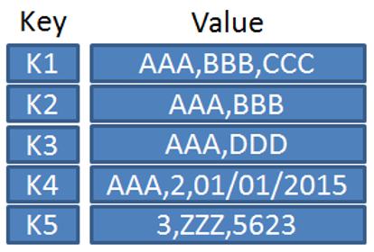

# Dari Programmer Zaman Now

# 1 - Pengenalan Redis

Redis singkatan dari Remote Dictionary Server adalah sistem basis data key-value berbasis memory

> Dictionary = tipe data seperti map, key value
> data yang dimasukkan ke redis akan dimasukkan ke dalam ram bukan harddisk
> redis jarang digunakan sbg datbase utama, karena kalau komputer mati data nya hilang.

Pertama kali rilis tahun 2009 sebagai project open source  
https://redis.io/

## Apa Itu Key-Value Database?

Redis adalah sistem basis data berbasis key-value  
Paradigma key-value adalah **paradigma dimana data disimpan dalam bentuk pair (key-value)**
Key mirip dengan **primary key dari data**, sedangkan value adalah **isi dari datanya**

## Key-Value Database

  
value dapat diisi csv,json, dll, kalau key harus string.

## Apa Itu In-Memory Database?

Redis menyimpan datanya di memory, namun kita bisa memintanya untuk menyimpan datanya secara regular permanen di disk.  
Data di disk hanya dijadikan backup ketika redis berjalan ulang, selama redis berjalan, redis hanya akan melakukan manipulasi data ke memory

> artinya maksimal data yang disimpan sesuai dengan jumlah memory nya.
> data yang ada di harddisk hanya sebagai backup oleh redis, bukan menyimpan data.

  
setiap kali melakukan CRUD akan dilakukan di memory (RAM). Secara reguler akan melakukan backup (dump) ke disk.
Tujuannya ketika redis mati, akan membaca hasil backup nya di disk.  
Kapasitas yang dapat dibackup sesuai dengan jumlah memory.

## 2 - Kapan Butuh Redis?

Saat kita membuat aplikasi, tidak langsung wajib menggunakan Redis  
Redis menggunakan memory sebagai media penyimpanan utama, otomatis harga memory lebih mahal dibandingkan disk  
Untuk menggunakan Redis, kita perlu lihat kasusnya secara detail

1. Ketika Database Utama Lambat  
     
   Contohnya kita punya database postgre, ada 1 query yang berat. Kalau datanya besar nanti, butuh waktu yang lama sekali. Walau sudah di tunning, optimize. Redis digunakan sebagai cache.

   Request pertama akan mengambil data ke database (postgre) lalu hasilnya disimpan ke redis (bisa dalam bentuk json), baru dibalikan ke usernya. Ketika ada user ke2 melakukan request yang sama, maka data akan diambil dari redis. Redis menggunakan memory jadi latensi nya bisa nano second.

2. Ketika Aplikasi Lain Lambat  
     
   Contoh nya ecommerce, butuh konek ke 3rd seperti payment gateway, logistik dll. Ketika aplikasi 3rd party memberikan respon yang lambat, maka kita bisa cache datanya ke dalam redis. Kita tidak bisa mengubah aplikasi 3rd party.

   Request ke2 akan mengambil dari redis.

3. Ketika Ada Proses Berat di Aplikasi  
     
   Misal 1 proses membutuhkan kalkulasi yang berat dan selalu itu saja hasilnya, maka hasil kalkulasi disimpan di redis.

4. Membuat Delayed Job  
     
   seperti php dan perl tidak bisa spawn thread baru/ tidak bisa melakukan asynchronus maka cocok pakai redis.  
   Comtohnya kirim email (lambat), dikirim ke redis (langsung dibalikan ke user sukses), lalu scheduler akan mengambil email dari redis.

   kalau di laravel ada laravel job untuk redis, kalau ruby ada juga delay job menggunakan framework rails

5. Dan masih banyak lainnya  
   Rata-rata redis digunakan untuk mempercepat `aplikasi yang lambat `
   Dan juga redis biasa digunakan untuk `caching`, menyimpan data secara sementara

## 3 - Menginstall Redis

https://redis.io/download  
Redis adalah aplikasi yang dibuat menggunakan bahasa pemrograman C  
Untuk menggunakan redis, kita harus melakukan kompilasi kode program Redis nya  
Disarankan menggunakan Docker untuk menjalankan redis, karena sampai saat ini belum tersedia binary file redis untuk Windows, Mac atau Linux

> dulu support binary windows hanya sampai redis 2.

### Menginstall Redis via Docker

Docker Image : https://hub.docker.com/_/redis/  
Docker Compose : https://github.com/ProgrammerZamanNow/belajar-redis/blob/master/redis/docker-compose.yaml  
Belajar Docker : https://www.youtube.com/playlist?list=PL-CtdCApEFH-A7jBmdertzbeACuQWvQao

```bash
docker-compose -f 1-redis-basic-compose.yaml up -d
```

untuk down nya

```bash
docker-compose -f 1-redis-basic-compose.yaml down
```

### Redis Server vs Redis Cli


Saat kita menginstall Redis, ada 2 aplikasi yang terinstall, Redis Server dan Redis Cli  
Redis Server adalah aplikasi server untuk Redis itu sendiri  
Redis Cli adalah aplikasi command line untuk client, dimana digunakan untuk berkomunikasi dengan Redis Server

#### Konek ke Redis Server via Redis Cli

`redis-cli -h <host> -p <port>`

> kalau tidak ada port otomatis menggunakan port defaultnya

masuk ke docker container untuk buka redis nya

```bash
docker container exec -it redis_basic bash
```

lalu masuk ke redisnya

```bash
redis-cli -h localhost
```

> kalau di prod, host nya diganti bukan localhost, seperti ip/domain

untuk mengecek terkoneksi dengan server, ketik `ping` di cli

## 4 - Configuration

Saat menjalankan redis, redis tidak butuh file konfigurasi  
Namun jika tidak menggunakan file konfigurasi, redis akan berjalan menggunakan konfigurasi default  
Ada baiknya kita membuat file konfigurasi agar pengaturannya bisa diubah, seperti maksimal memori yang bisa digunakan.  
https://github.com/antirez/redis/blob/6.0/redis.conf

Docker Compose : https://github.com/ProgrammerZamanNow/belajar-redis/blob/master/redis-with-config/docker-compose.yaml

> disesuaikan dengan versi nya

docker-compose up

```bash
docker-compose -f 2-redis-basic-compose-with-config.yaml up -d
```

docker-compose down

```bash
docker-compose -f 2-redis-basic-compose-with-config.yaml down
```

## 5 - Database

Redis memiliki konsep database seperti pada relational database mysql atau postgre  
Di redis kita bisa membuat database dan menggunakan database nya  
Namun sedikit berbeda, jika di relational database kita bisa membuat database dengan menggunakan nama database, di redis kita hanya bisa menggunakan angka sebagai database  
Secara default database di redis adalah 0 (nol)  
Kita bisa menggunakan database sejumlah maksimal sesuai dengan konfigurasi yang kita gunakan di file konfigurasi

### Operasi Database

| Operasi         | Keterangan                |
| --------------- | ------------------------- |
| select database | Selecting database number |
